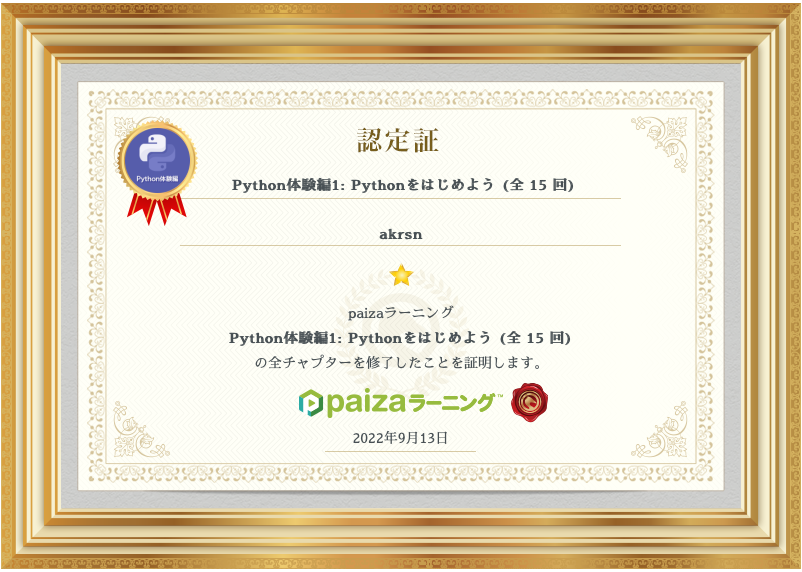

# ex1 — イントロと Python 入門

## 演習課題

### 事前課題 0（完了していない人） {: .exercise }

[ex0 — Python プログラミング環境の準備](ex0.md) を済ませてください。

[paiza ラーニングでクーポンコードを使う](setup/paiza-coupon.md) を参考にして、
[paiza ラーニング](https://paiza.jp/works/) の利用準備をします。
ニックネーム（下図の `akrsn` の部分）は画面右上のメニューの「アカウント設定」から指定できます。

課題の提示・提出・自動採点はすべて **[aiJudge](https://judge.math.ryukoku.ac.jp/)**
（**龍谷大学の全学認証でログイン**）で行います。使い方は
[aiJudge 学生向けガイド](https://sanoakr.github.io/aijudge/student/) を参照してください。

<!-- aijudge:begin ex1/paiza1 -->
### 認定証提出（paiza「Python 体験編 1: Python をはじめよう」） {: .exercise }

[paiza ラーニング](https://paiza.jp/works/) の講座
[「Python 体験編 1: Python をはじめよう」（全 15 チャプター）](https://paiza.jp/works/python/trial)
のすべての演習問題に合格すると得られる**認定証の画面キャプチャ**を提出してください。

1. [paiza ラーニングでクーポンコードを使う](https://sanoakr.github.io/rumath-network/setup/paiza-coupon/)
   を参考にして、paiza ラーニングの利用準備をします。
2. 講座のすべての演習問題に合格し、認定証を表示します。
   合格後の認定証は[講座のレッスン一覧](https://paiza.jp/works/python/trial)からいつでも確認できます。
3. 認定証に表示される**ニックネームには、必ず自身の学籍番号を含めて**ください。
4. 認定証の画面をスクリーンショット（PNG / JPEG）に撮り、この課題に提出してください。

この課題は自動採点ではありません。教員・TA が確認してから採点します。
結果がすぐに反映されなくても心配ありません。
<!-- aijudge:end -->

{ width="600" }

### 演習課題 2. オンラインジャッジで課題を提出する {: .exercise }

演習課題 1 でログインした **aiJudge** で、ex1 の次の課題すべてで**満点を取って**ください。

<!-- aijudge:begin ex1:p2,p3,p4 -->
- hello.py
- input.py
- nhello.py
<!-- aijudge:end -->

各問題のページに、使う関数（`print()`・`input()`・`int()`）の説明があります。

!!! note "提出は何度でもできます"
    aiJudge は提出のたびに自動採点します。満点になるまで何度でも提出して構いません。
