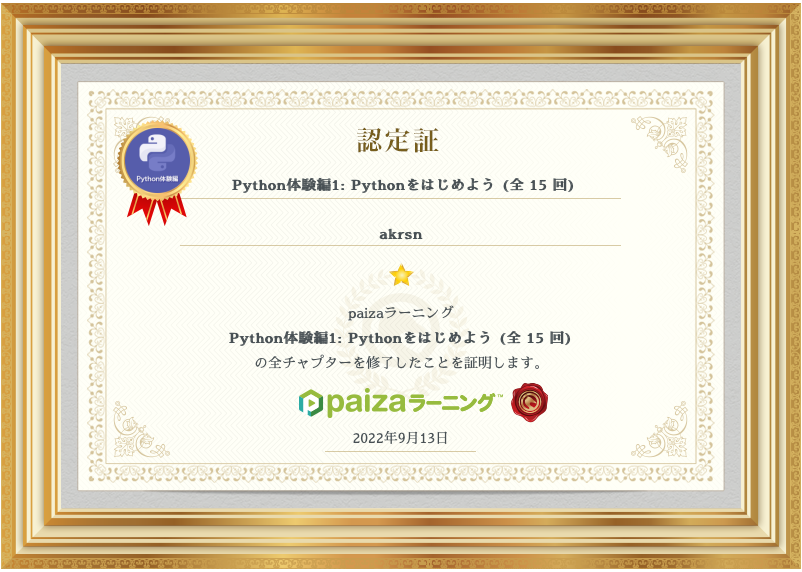

# ex1 — イントロと Python 入門

## 演習課題 {: .exercise }

### 事前課題 0（完了していない人） {: .exercise }

[ex0 — Python プログラミング環境の準備](ex0.md) を済ませてください。

[paiza ラーニングでクーポンコードを使う](setup/paiza-coupon.md) を参考にして、
[paiza ラーニング](https://paiza.jp/works/) の利用準備をしてください。
ニックネーム（下図の `akrsn` の部分）は、画面右上のメニューの「アカウント設定」で指定できます。

課題の提示・提出・自動採点は、すべて [aiJudge](https://judge.math.ryukoku.ac.jp/) で行います。
aiJudge には龍谷大学の全学認証でログインしてください。使い方は
[aiJudge 学生向けガイド](https://sanoakr.github.io/aijudge/student/) を参照してください。

<!-- aijudge:begin ex1/paiza1 -->
### 認定証提出（paiza「Python 体験編 1: Python をはじめよう」） {: .exercise }

[paiza ラーニング](https://paiza.jp/works/) の講座
[「Python 体験編 1: Python をはじめよう」（全 15 チャプター）](https://paiza.jp/works/python/trial)
のすべての演習問題に合格すると得られる認定証の画面キャプチャを提出してください。

1. [paiza ラーニングでクーポンコードを使う](https://sanoakr.github.io/rumath-network/setup/paiza-coupon/)
   を参考にして、paiza ラーニングの利用準備をします。
2. 講座のすべての演習問題に合格し、認定証を表示します。
   合格後の認定証は[講座のレッスン一覧](https://paiza.jp/works/python/trial)からいつでも確認できます。
3. 認定証に表示されるニックネームには、**必ず自分の学籍番号を含めて**ください。
4. 認定証の画面をスクリーンショット（PNG / JPEG）に撮り、この課題に提出してください。

この課題は自動採点ではなく、教員・TA が確認してから採点します。そのため、結果がすぐに反映されないことがあります。
<!-- aijudge:end -->

{ width="600" }

### 演習課題 2. オンラインジャッジで課題を提出する {: .exercise }

aiJudge の ex1 にある次の課題すべてで、**満点を取って**ください。

<!-- aijudge:begin ex1:p2,p3,p4 -->
- hello.py
- input.py
- nhello.py
<!-- aijudge:end -->

各問題のページには、使用する関数（`print()`・`input()`・`int()`）の説明があります。

!!! note "提出は何度でもできます"
    aiJudge は提出のたびに自動で採点します。満点になるまで何度提出しても構いません。
