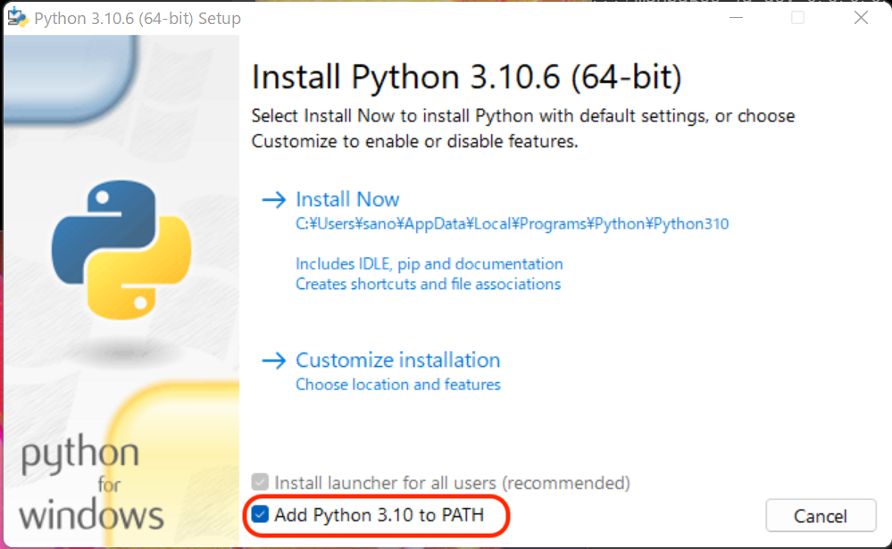
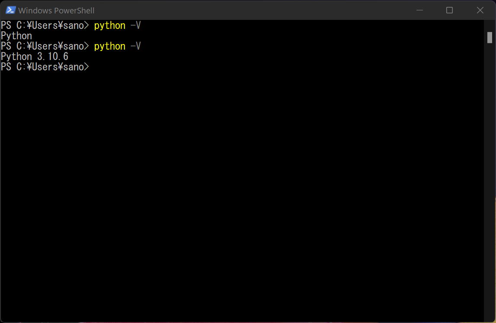
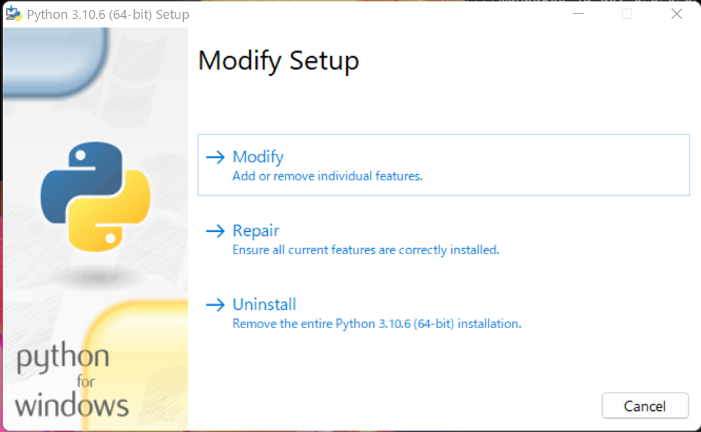
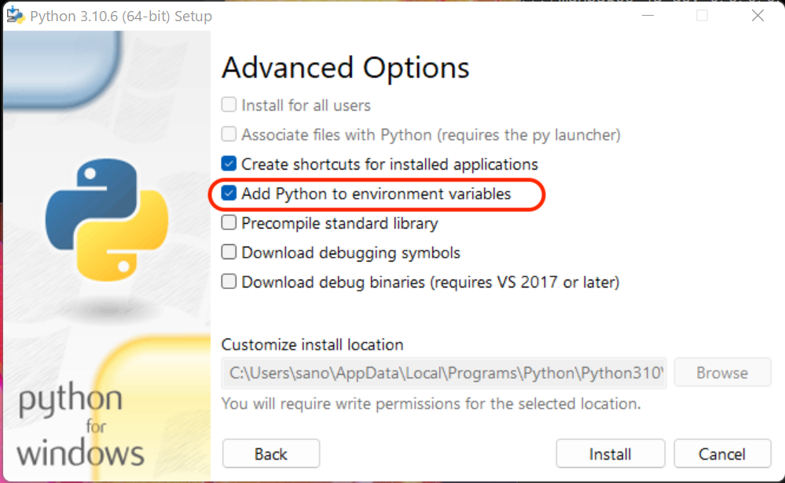
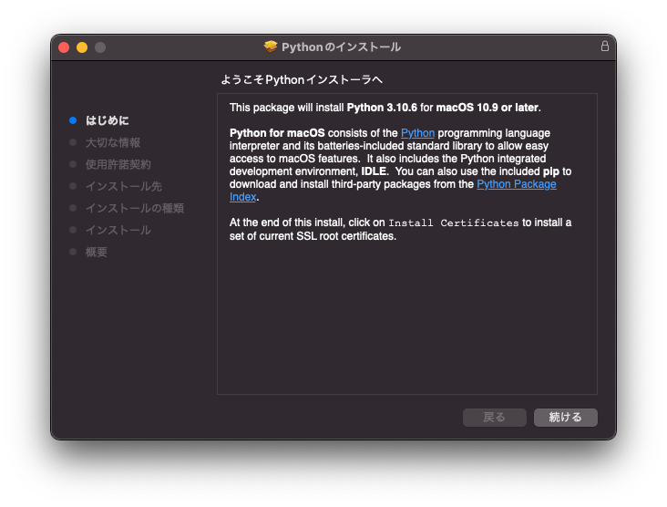
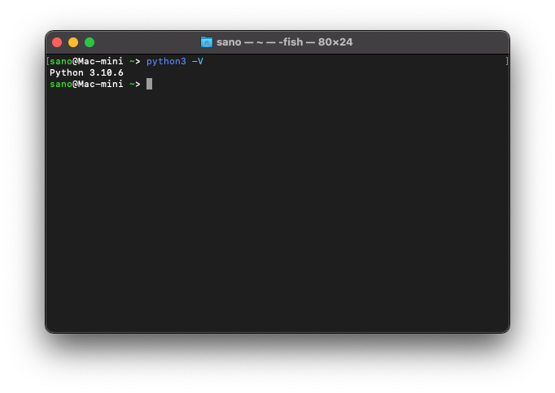

# Python のインストール

Python の環境は Microsoft Store や Homebrew、あるいは WSL を利用しても構築することができます。ここでは、とりあえずのオススメとして、[python.org](https://www.python.org/) のインストールパッケージを利用する方法を説明します。現在の Python の最新バージョンは 3.14 系ですが、この科目の内容であれば、すでにインストール済みの Python3 をそのまま使っても問題ありません。

1. [python.org](https://www.python.org/) の [Downloads](https://www.python.org/downloads/) より、利用している OS に対応したインストールパッケージをダウンロードしてください。Webブラウザで  [Downloads](https://www.python.org/downloads/) すると自動的に OS に対応した最新のインストールパッケージのリンクが上部に表示されます。

=== "Windows の場合"

    1. ダウンロードしたインストールパッケージを実行してください。
    2. 表示される画面の最下部にある「Add Python 3.x to PATH」にチェックを入れて「Install Now」よりインストールを開始します。
        

    3. 「Setup was successful」で成功です。

    #### インストールの確認

    1. 新しい Windows Powershell を立ち上げて、以下のコマンドを入力します。
        ```sh
        python -V
        ```

    2. 正しくインストールされていれば Python のバージョンが表示されます。失敗していれば「Python」のみでバージョン表記がありません（1番目の例）。
        

    #### インストールの修正

    1. インストールの確認がうまくできなかった場合、「Add Python 3.x to PATH」のチェック漏れの可能性があります。
    2. インストールパッケージを再度起動し、Modify から「Add Python to environment variables」をチェックしてInstall することでこれを修正できます。
        

        

=== "macOS の場合"

    1. ダウンロードしたインストールパッケージを実行してください。
    2. 画面の指示に従いインストールを進めてください。

    

    3. 「インストールが完了しました。」で成功です。

    #### インストールの確認

    1. アプリケーション > ユーティリティ にある「ターミナル」を起動し以下のコマンドを入力します。
        ```sh
        python3 -V
        ```

    2. 正しくインストールされていれば Python のバージョンが表示されます。
        

        #### macOS の Python バージョン

        macOS の場合、インストールした Python 3.x.y を実行するコマンドは python3 です（python では無いことに注意！）。

        macOS 12.3 より前のバージョンでは、Python 2.x.y が標準でインストールされており、

        - python コマンドで  2.x.y が、
        - python3 コマンドで 3.x.y が

        実行されるので注意してください。

        macOS 12.3 以降では、Python の同梱が無くなり python コマンドがありません。
