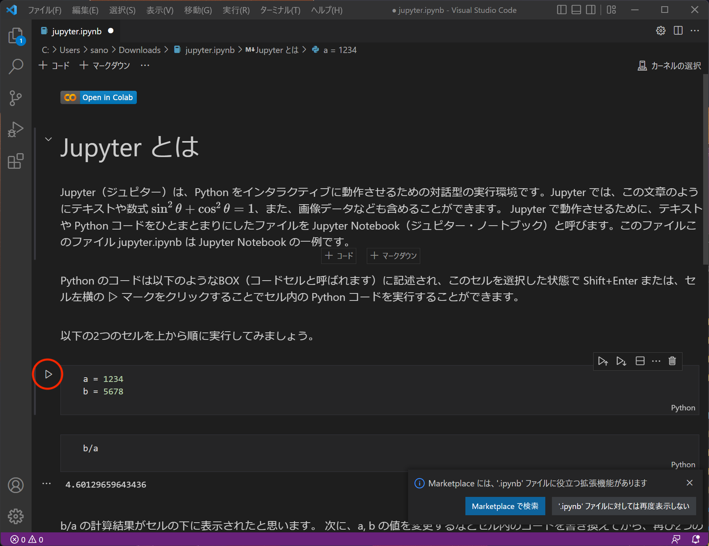
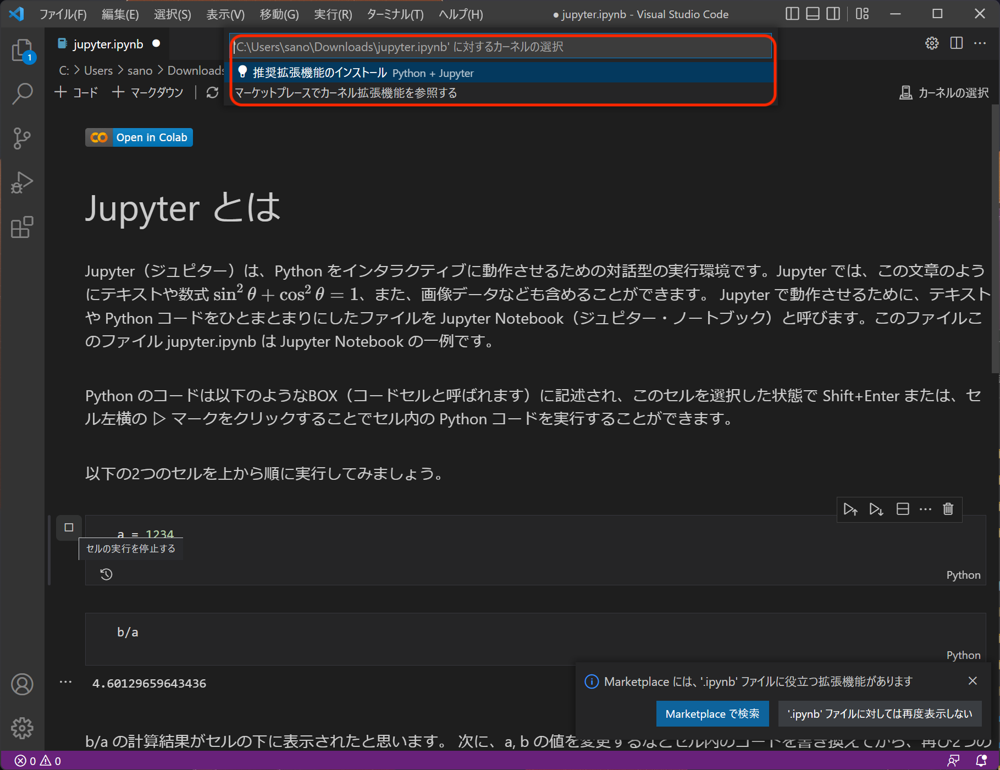
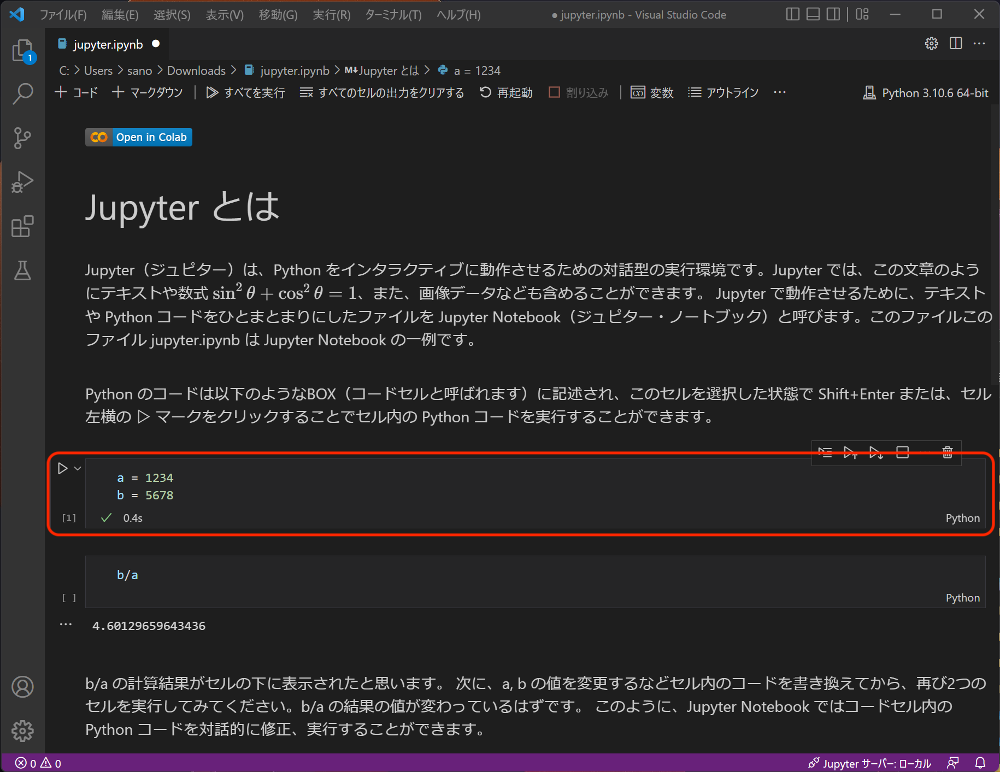

# VS Code で Jupyter 環境を構築

ここではVisual Studio Code を使って自分のPC上で Jupyter Notebook を環境を構築する方法をメモしておきます。Python の実行環境をインストール済みであることを前提としています。

Jupyter Notebook ファイルは、Google Colaboratory などのクラウド環境でも簡単に動かすことができますが、自分のローカル環境を作っておくとネットワーク環境に依存しませんし、時間制限もなく Jupyter を利用することができます。

1. まずは、適当な Notebook ファイル（無ければ以下の  jupyter.ipynb）を VS Code で開いてみましょう。ipynb 形式なら何でも構いません。
    - [jupyter.ipynb（このリポジトリ）](https://github.com/sanoakr/rumath-network/blob/main/jupyter.ipynb)

2. 含まれているコードセルを実行してみます。
    

3. コードセルが実行できれば Jupyter 環境が構築済みです。コードセルが実行できない場合、ウィンドウ上部に以下のようなメッセージが表示されます。「 💡  推奨拡張機能のインストール」をクリックすると、必要な拡張機能のインストールが開始されます。
    

4. 拡張機能のインストールが完了したら、再度コードセルを実行してみましょう。コードセルの実行が成功するはずです。以後は、ipynb 形式のファイルを読み込むだけでOKです。
    
